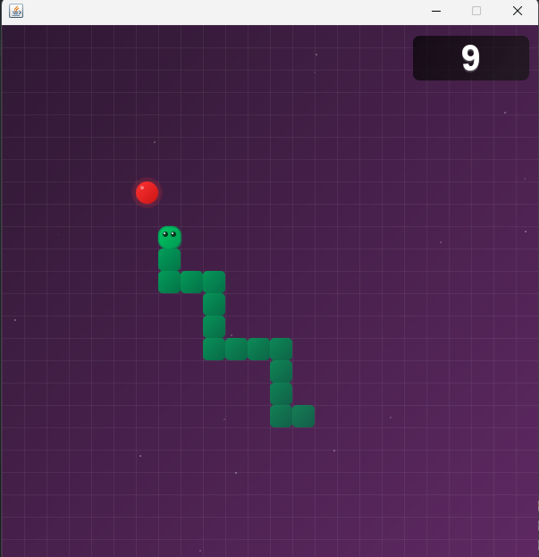

# 🐍 Java-Snake-Game

A modern implementation of the classic Snake game, developed in Java using the Swing GUI library. This version offers a nostalgic gaming experience with enhanced graphics and sound effects.

### New Version

_Gameplay_



### Legacy Version

_Gameplay_


## ✨ Features

- 🐍 Classic snake gameplay
- 🎵 Dynamic sound effects
- 🌟 Animated background with stars
- 📊 Real-time score tracking
- ⚡ Smooth snake movement
- 🎮 Responsive controls

## 🎮 Controls

- `↑` (Up Arrow) - Move Up
- `↓` (Down Arrow) - Move Down
- `←` (Left Arrow) - Move Left
- `→` (Right Arrow) - Move Right
- `P` - Pause/Resume Game
- `Space` - Restart Game on Game Over

## 🚀 Getting Started

### Prerequisites

- Java Development Kit (JDK) 8 or higher
- Java Runtime Environment (JRE)

### Installation

1. Clone the repository

```
git clone https://github.com/VinayShetyeOfficial/snake-game-java.git
```

2. Navigate to the project directory

```
cd snake-game-java
```

3. Compile the source code

```
javac SnakeGame.java
```

4. Run the game

```
java SnakeGame
```

## 📁 Project Structure

```
snake-game-java
├── new-version
│  ├── asset
│  │  ├── food.wav
│  │  └── gameover.wav
│  ├── GameFrame.java
│  ├── GamePanel.java
│  ├── HighScore.java
│  ├── SnakeGame.java
│  └── SoundManager.java
├── old-version
│  ├── GameFrame.java
│  ├── GamePanel.java
│  └── SnakeGame.java
├── LICENSE
└── README.md
```

## 🛠️ Built With

- Java
- Swing GUI Library
- Java Sound API

## 🎯 Future Improvements

- [ ] Add different levels with increasing difficulty
- [ ] Implement power-ups and special effects
- [ ] Add customizable snake skins
- [ ] Create a leaderboard for high scores

## 🤝 Contributing

Contributions are welcome! Please feel free to submit a Pull Request.

1. Fork the project
2. Create your feature branch (`git checkout -b feature/AmazingFeature`)
3. Commit your changes (`git commit -m 'Add some AmazingFeature'`)
4. Push to the branch (`git push origin feature/AmazingFeature`)
5. Open a Pull Request

## 📝 License

This project is licensed under the [MIT License](./LICENSE) - see the [LICENSE](./LICENSE) file for details.

## 📧 Contact

Vinay Shetye - [GitHub](https://github.com/VinayShetyeOfficial) - vinay.shetye.personal@outlook.com  
Project Link: [https://github.com/VinayShetyeOfficial/snake-game-java](https://github.com/VinayShetyeOfficial/snake-game-java)
